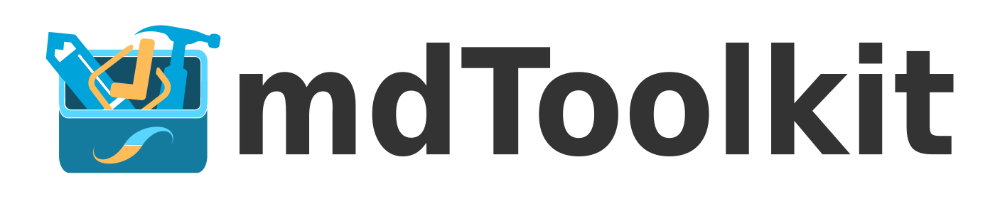

# Introduction

This book contains the documentation for the *Alaska Data Integration Working Group (ADIwg) Metadata Toolkit* (standards, applications, libraries, and services).

## Open Source Toolkit

The toolkit is open source, public domain, and completely free, the source code for all the tools is available on [GitHub](https://github.com/adiwg).

Issues and questions related to the toolkit should be posted in the [issues](https://help.github.com/articles/about-issues/) section of the appropriate respository. Alternatively, send an e-mail to <adiwg@adiwg.org>.

## Help and Support

You can send questions to <adiwg@adiwg.org> or create an issue (see above). Of course, we recommend reading through the relevant section(s) of this book to see if your question is covered.

## Contribute to this documentation

You can contribute to improve this documentation on [GitHub](https://github.com/adiwg/mdBook). If you notice a mistake or have a suggestion, you may create an issue here: <https://github.com/adiwg/mdBook/issues>.

----


