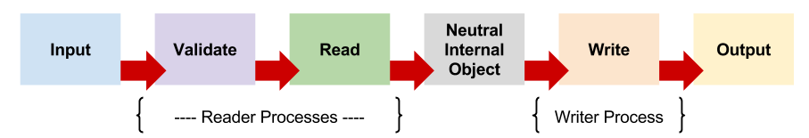
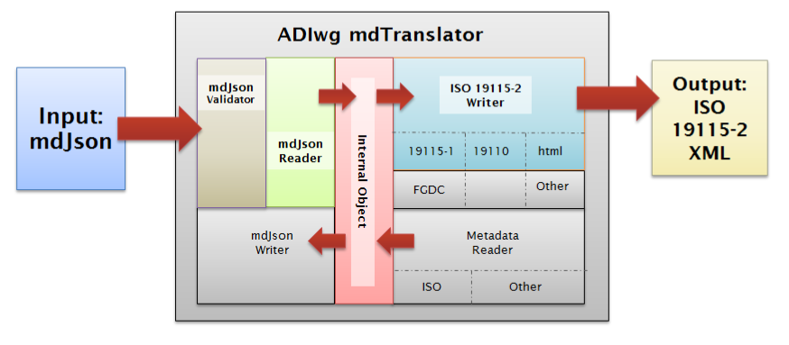

# Architecture

The mdTranslator's work flow is logically divided into the following six primary processes:

After invoking the mdTranslator via one of the methods described in the [Usage](usage.md) section of mdBook, the mdTranslator imports the users metadata file and turns control over to the requested *reader*.  The *reader* manages two of the primary processes (Validate, and Read) and if successful calls the requested writer.  The *writer* then manages the Write process and hands the result back to mdTranslator to handle output of the package.  Each of these primary processes is described in more detail below.

The mdTranslator architecture is designed to support multiple readers and writers which all of which use the *internal object* to store and retrieve their metadata content.  In this way content from any *reader* can be translated into output using any of the mdTranslator's *writers*.

In the depiction of the mdTranslator architecture below an metadata input file formatted in mdJson is passed to the mdTranslator which hands it off to the mdJson reader for processing.  
A brief discussion of each primary process step follows:

## Input

As a rule, metadata input to the mdTranslator module is passed to the mdTranslator in a string variable in the parameter list invoking the translator.  The single exception is when using the CLI a file name may passed in place of the string.  The CLI will read the file into a string and then call mdTranslator in the usual way.

The translator does not examine the contents of the input metadata in any way.  The determination as to which reader should interpret the 

