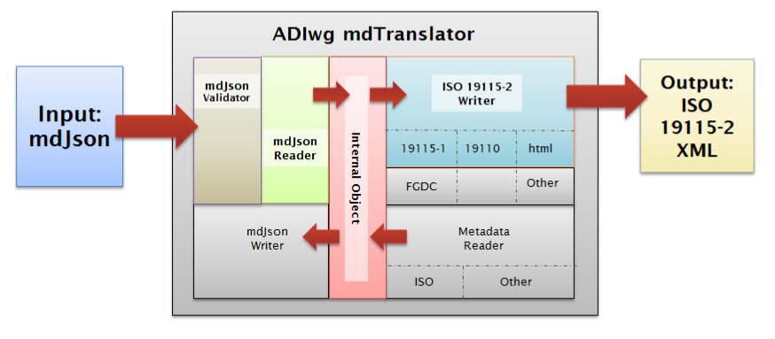

# Architecture

The mdTranslator's work flow is logically divided into the following six processes:

After invoking the mdTranslator via one of the methods described in the [Usage](../mdcodes/usage.md) section of mdBook, the mdTranslator examines the parameters passed in and turns control over to the requested *reader*.

The *reader* manages the next two processes (Validate and Read) and if these processes and returns control to mdTranslator.  If the reader processes were successful, mdTranslator will call the requested writer.

The *writer* then manages the Write process and hands the result back to mdTranslator to handle output of the package in whatever form the user requested.  Each of these primary processes are described in more detail on the following pages.

The mdTranslator architecture has been designed to support multiple readers and writers all of which use mdTranslator's *internal object* to store and retrieve their metadata content.  In this way content from any *reader* can be translated into output via any of the mdTranslator's *writers*.

In the depiction of the mdTranslator architecture below a metadata input file formatted in mdJson is passed through mdTranslator to generate ISO 19115_2 XML metadata.   
A brief discussion of each process step follows.

